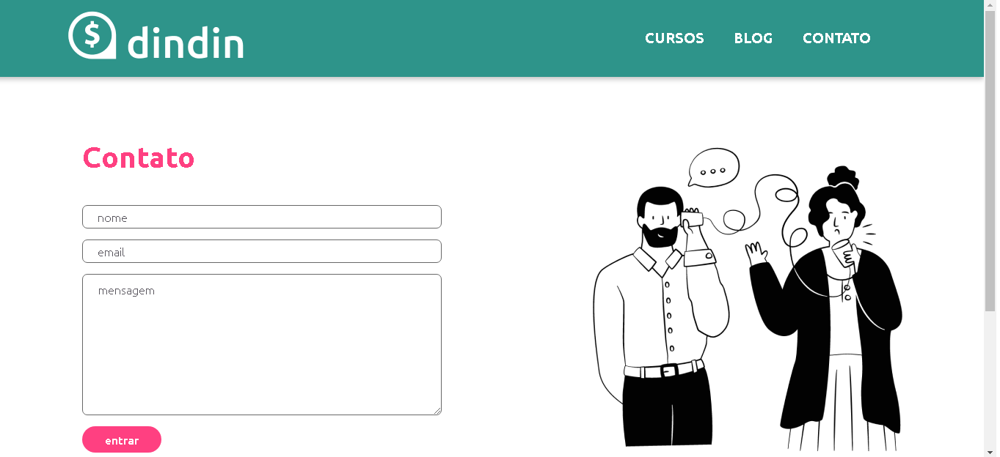

# Projeto dindin

Pasta para o projeto dindin.  
Header feito  
Footer feito 
Conteúdo do index produzido, falta configurar no css   
 
Página contato criado e feito o css.

## Acesso
Para acessar o projeto, utilize a url a seguir:
[Projeto dindin - Grupo 1](https://alexandrespin.github.io/DesafioDindin/)

<!--  -->

